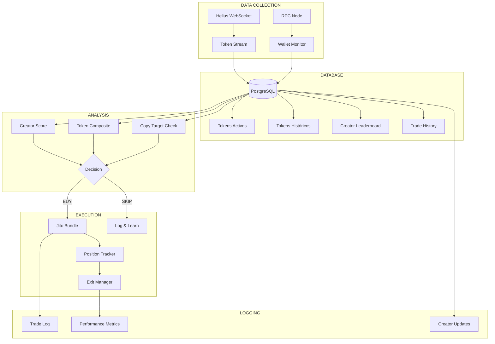

# INVESTIGACIÓN DE MERCADO: Pump.fun Bots & Data Analysis

```
╔══════════════════════════════════════════════════════════════════════════════╗
║                    CIPHER INTELLIGENCE REPORT                                 ║
║                    Pump.fun Trading Bots - Estado del Arte                   ║
╠══════════════════════════════════════════════════════════════════════════════╣
║  Fecha: 2024-12-29                                                           ║
║  Fuentes: GitHub, Reddit, Foros, Documentación de Bots                       ║
║  Objetivo: Entender qué funciona y qué datos trackear                        ║
╚══════════════════════════════════════════════════════════════════════════════╝
```

---

## HALLAZGOS CLAVE

### 1. ESTADÍSTICAS REALES DEL MERCADO

```yaml
datos_pump_fun:
  snipers_coordinados:
    wallets_sniper: 4,600+
    deployers_involucrados: 10,400+
    profit_extraido: 15,000+ SOL
    tasa_exito_snipers: 87%  # Mucho mayor que traders normales

  tasa_graduacion_tokens:
    promedio_plataforma: 0.52%  # Solo 1 de cada 200 tokens gradúa
    top_performers: 0.7-1.2%    # Aún así muy bajo

  volumen_bots:
    porcentaje_dex_volume: 50-70%  # La mayoría del volumen es bots
    dias_pico: "Hasta 70% es arbitraje automatizado"
```

**Insight crítico**: El 87% de éxito de snipers coordinados vs traders normales indica que HAY edge en automatización + análisis de datos.

---

### 2. LO QUE HACEN LOS BOTS EXITOSOS

#### A) Tracking de Creadores (Creator Analysis)

El bot más sofisticado que encontré ([Dexter](https://github.com/FLOCK4H/Dexter)) hace esto:

```yaml
creator_scoring:
  factores_evaluados:
    - total_swaps_historicos
    - median_peak_marketcap
    - tasa_exito_tokens_previos
    - tiempo_promedio_hasta_peak
    - min_swaps_antes_de_peak

  algoritmo_trust_factor:
    min_swap_threshold: "500-2500 según cantidad de tokens"
    peak_mcap_median: "25,000-30,000"
    trust_ratio: 0.65

  accion:
    si_creator_en_leaderboard: "Auto-comprar su nuevo token"
    position_size_high_trust: "$15 USD"
    position_size_medium_trust: "$10 USD"
```

#### B) Composite Score de Tokens

```python
# Fórmula real usada por Dexter
composite_score = (0.4 * price_trend_score) + (0.6 * transaction_momentum_score)

# El momentum pesa MÁS que el precio
# Porque el volumen de transacciones predice mejor que el precio actual
```

#### C) Base de Datos Requerida

```yaml
estructura_db_profesional:
  tabla_tokens_activos:
    - mint_id
    - name, symbol
    - owner_address  # CRÍTICO: trackear al creador
    - precio_actual, ohlc
    - marketcap, liquidity, volume
    - tx_count, holder_count
    - bonding_curve_progress
    - timestamp_creacion

  tabla_tokens_historicos:
    - mismos campos + peak_mcap + final_mcap
    - tiempo_hasta_graduation
    - profit/loss para creador

  tabla_creadores:
    - wallet_address
    - tokens_creados
    - avg_profit_per_token
    - rugs_count
    - graduation_rate
    - trust_score

  espacio_requerido: "100GB+ (crece diario)"
```

---

### 3. MÉTRICAS QUE IMPORTAN (Copy Trading)

De [OdinBot Docs](https://docs.odinbot.io/tracking-academy/trading-strategies/pump.fun-101-wallets-analysis-and-insights-vic):

```yaml
metricas_wallet_analysis:
  win_rate:
    rango_ideal: "65-90%"
    muy_bajo: "< 65% = inconsistente"
    sospechoso: "> 95% = posible manipulación"
    nota: "45% win rate puede ser rentable si wins son grandes"

  ejemplo_real:
    wallet: "45% win rate"
    profit_30_dias: "$2,036"
    estrategia: "Pequeñas pérdidas frecuentes, grandes gains ocasionales"

  otro_ejemplo:
    wallet: "55.57% win rate"
    volumen_total: "$6.8 millones"
    nota: "Excepcional vs promedio de plataforma"
```

#### Red Flags a Evitar

```yaml
red_flags_wallets:
  - trades_en_danger_tokens: true
  - mcap_bajo_10k_frecuente: true
  - price_spike_1s_post_trade: "15-20% = muy copiada"
  - patron_pump_and_dump: true

green_flags:
  - opera_above_10k_mcap: true
  - slippage_controlado: "5-10% vs 25-50%"
  - consistency_over_time: true
  - risk_management_visible: true
```

---

### 4. VELOCIDAD Y LATENCIA

```yaml
velocidad_critica:
  red_hogar_3mbps: "1-2 segundos confirmación"
  red_industrial_azure: "0.2-1 segundo confirmación"

  ventana_oportunidad:
    primeros_30_segundos: "80% del profit potencial"
    primeros_5_segundos: "Los mejores entries"

  prioridad:
    jito_tips: "Para garantizar inclusión en bloque"
    priority_fees: "Dinámicos según congestión"
```

---

### 5. ESTRATEGIAS DE PROFIT-TAKING

De análisis de bots exitosos:

```yaml
estrategia_escalonada:
  nivel_1:
    trigger: "+25%"
    accion: "Vender 50%"
  nivel_2:
    trigger: "+25% adicional (total +56%)"
    accion: "Vender 75% del restante"
  nivel_3:
    trailing_stop: "-15% desde ATH"
    accion: "Vender resto"

alternativa_agresiva:
  trigger_unico: "+50%"
  accion: "Vender 100%"
  nota: "Menos profit pero más consistente"
```

---

### 6. ANTI-BOT MEASURES (Lo que enfrentamos)

```yaml
mecanismos_anti_bot:
  fees_dinamicos:
    concepto: "Fees altos al inicio, bajan con mcap"
    efecto: "Dificulta snipe inmediato"

  bundle_detection:
    metodo: "Detectar TXs en mismo bloque que creación"
    efecto: "Pueden bloquear o penalizar"

  evasion_tecnicas:
    multi_hop_funds: "Fondos pasan por múltiples wallets"
    multi_sig_txs: "Transacciones multi-firma"
    wallet_rotation: "Wallets temporales descartables"
```

---

### 7. HERRAMIENTAS DE TRACKING EXISTENTES

```yaml
plataformas_tracking:
  kolscan:
    funcion: "Tracker de wallets top memecoin traders"
    datos: "PnL tiempo real, leaderboards"
    costo: "Gratis (ahora propiedad de Pump.fun)"

  axiom_trade:
    funcion: "Leaderboard de traders"
    datos: "Analytics + wallet tracking"

  gmgn_monitor:
    funcion: "Monitoreo tiempo real"

  dune_dashboards:
    funcion: "Top Solana traders"
    datos: "Analytics on-chain"
```

---

### 8. ARQUITECTURA RECOMENDADA (Basada en lo que funciona)



---

### 9. SAMPLE SIZE PARA ANÁLISIS

De [CoinBureau Best Practices](https://coinbureau.com/guides/how-to-backtest-your-crypto-trading-strategy/):

```yaml
requisitos_analisis:
  minimo_trades: 100+
  condiciones_mercado: "Up, down, sideways"
  ajustes: "Incluir fees y slippage real"
  metricas: "Sharpe ratio, profit factor"

signos_overfitting:
  - backtest_perfecto: "Win rate muy alto, drawdown tiny"
  - sensible_a_params: "Pequeños cambios destruyen performance"
  - solo_funciona_en_un_periodo: true

regla_oro: "Si no puedes explicar el edge en 2 oraciones, probablemente es overfit"
```

---

### 10. LO QUE DEBERÍAMOS IMPLEMENTAR

```yaml
prioridad_1_data_collection:
  - [ ] WebSocket a Pump.fun tokens nuevos
  - [ ] Guardar CADA token creado con metadata
  - [ ] Trackear creator wallets históricamente
  - [ ] Monitorear wallets exitosas conocidas

prioridad_2_analysis:
  - [ ] Creator scoring basado en historial
  - [ ] Composite score (price + momentum)
  - [ ] Detección de wallets muy copiadas
  - [ ] Red flags automáticos

prioridad_3_execution:
  - [ ] Snipe rápido con priority fees
  - [ ] Position sizing según score
  - [ ] Exit escalonado automático
  - [ ] Stop loss garantizado

prioridad_4_logging:
  - [ ] Cada trade con todos los datos
  - [ ] Performance por estrategia
  - [ ] Actualización de creator scores
  - [ ] Exportar para análisis offline
```

---

## CONCLUSIONES

```
╔══════════════════════════════════════════════════════════════════════════════╗
║                         INSIGHTS PRINCIPALES                                  ║
╠══════════════════════════════════════════════════════════════════════════════╣
║                                                                               ║
║  1. DATA ES REY                                                               ║
║     Los bots exitosos tienen BASES DE DATOS de creadores, no solo snipean    ║
║     ciego. Trackean historial y calculan trust scores.                       ║
║                                                                               ║
║  2. CREATOR TRACKING > TOKEN ANALYSIS                                         ║
║     Es más importante QUIÉN crea el token que el token en sí.                ║
║     Creadores con historial de éxito → mayor probabilidad de profit.         ║
║                                                                               ║
║  3. WIN RATE NO ES TODO                                                       ║
║     45% win rate puede ser más profitable que 80% si los wins son grandes.  ║
║     Trackear profit/loss ratio, no solo win/loss count.                      ║
║                                                                               ║
║  4. VELOCIDAD IMPORTA PERO NO ES TODO                                        ║
║     Primeros 5-30 segundos son críticos, pero un buen filtro vale más       ║
║     que 100ms de ventaja en un token malo.                                   ║
║                                                                               ║
║  5. EL MERCADO ESTÁ SATURADO DE BOTS                                         ║
║     50-70% del volumen es bots. Competimos contra sistemas sofisticados.    ║
║     Edge viene de MEJOR ANÁLISIS, no solo velocidad.                         ║
║                                                                               ║
║  6. LOGGING EXHAUSTIVO = MEJORA CONTINUA                                     ║
║     Los pros documentan TODO. Sin datos no hay optimización.                ║
║     100+ trades mínimo para conclusiones estadísticas.                       ║
║                                                                               ║
╚══════════════════════════════════════════════════════════════════════════════╝
```

---

## FUENTES

- [Dexter - Pump.fun Sniper Bot](https://github.com/FLOCK4H/Dexter)
- [OdinBot - Pump.fun Copy Trading Guide](https://docs.odinbot.io/tracking-academy/trading-strategies/pump.fun-101-wallets-analysis-and-insights-vic)
- [Solana Copy Trading Bot](https://github.com/imcrazysteven/Solana-Copy-Trading-Bot)
- [QuickNode - Copy Trading Tutorial](https://www.quicknode.com/guides/solana-development/defi/pump-fun-copy-trade)
- [CoinBureau - Backtesting Best Practices](https://coinbureau.com/guides/how-to-backtest-your-crypto-trading-strategy/)
- [Bitget - Pump.fun Sniping Analysis](https://www.bitget.com/news/detail/12560604803448)
- [CoinCodeCap - Pump.fun Strategies](https://coincodecap.com/5-best-pump-fun-trading-strategies-for-meme-coins)
- [RPC Fast - Solana Trading Bot Guide](https://rpcfast.com/blog/solana-trading-bot-guide)

---

**CIPHER** | Intelligence Report v1.0
*"Data es la ventaja competitiva"*
