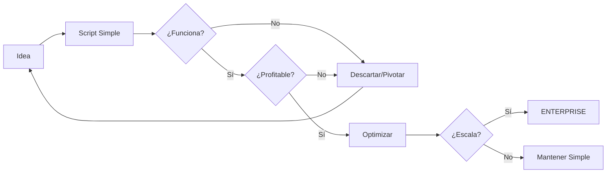
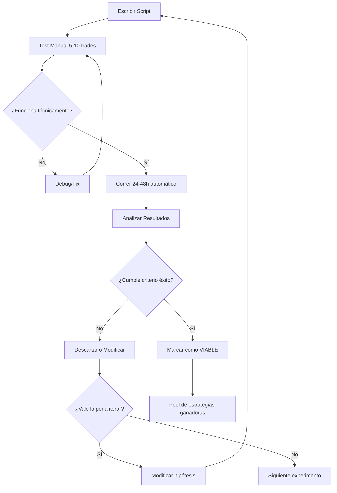
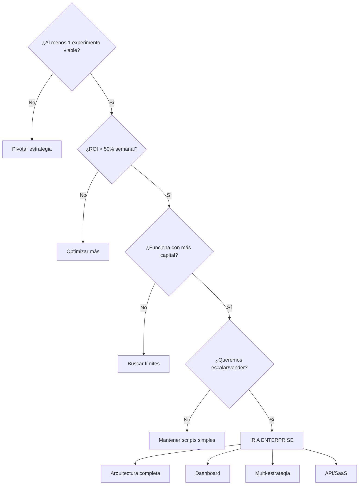

# CIPHER-001: PLAN DE EXPERIMENTACIÓN RÁPIDA

```
╔══════════════════════════════════════════════════════════════════════════════╗
║                    FASE EXPERIMENTAL                                          ║
║                    "Probar rápido, fallar barato, escalar lo que funciona"   ║
╠══════════════════════════════════════════════════════════════════════════════╣
║  Filosofía: Scripts simples → Validar → Iterar → Enterprise si funciona     ║
║  Timeline: 1-2 semanas de experimentación                                     ║
║  Capital de prueba: 0.5-2 SOL                                                 ║
╚══════════════════════════════════════════════════════════════════════════════╝
```

---

## ESTRATEGIA GENERAL

```
NO CONSTRUIR CASTILLO → CONSTRUIR TIENDA DE CAMPAÑA → PROBAR → SI FUNCIONA → CASTILLO
```



---

## EXPERIMENTOS A PROBAR

### EXPERIMENTO 1: Pump.fun Sniper Básico
```yaml
objetivo: "Comprar tokens nuevos en Pump.fun rápido"
hipotesis: "Entrar en primeros 30 segundos da ventaja de precio"
script: sniper_v1.py
tiempo_desarrollo: 2-3 horas
capital_prueba: 0.2 SOL
duracion_test: 24-48 horas
metricas:
  - win_rate
  - avg_profit_per_trade
  - tiempo_de_entrada
criterio_exito: "Win rate > 30%, profit promedio > 20%"
```

### EXPERIMENTO 2: Sniper con Filtros Sociales
```yaml
objetivo: "Solo comprar tokens que tienen hype en Twitter/Telegram"
hipotesis: "Tokens con señal social tienen mejor probabilidad"
script: sniper_social_v1.py
tiempo_desarrollo: 3-4 horas (incluye scraping básico)
capital_prueba: 0.2 SOL
duracion_test: 24-48 horas
metricas:
  - win_rate comparado con sniper básico
  - correlacion social_signal vs profit
criterio_exito: "Win rate > 40%"
```

### EXPERIMENTO 3: Copy Trading de Wallets Exitosas
```yaml
objetivo: "Copiar trades de wallets que consistentemente ganan"
hipotesis: "Seguir a ganadores es más seguro que snipear ciego"
script: copy_trader_v1.py
tiempo_desarrollo: 2-3 horas
capital_prueba: 0.3 SOL
duracion_test: 48-72 horas
metricas:
  - pnl vs wallet copiada
  - latencia de copia
  - win_rate
criterio_exito: "Replicar 80%+ del profit de wallet objetivo"
```

### EXPERIMENTO 4: Arbitraje Pump.fun → Raydium
```yaml
objetivo: "Comprar en bonding curve, vender en Raydium post-graduation"
hipotesis: "Hay spread entre bonding curve y DEX real"
script: arb_pump_ray_v1.py
tiempo_desarrollo: 3-4 horas
capital_prueba: 0.3 SOL
duracion_test: 48-72 horas (depende de graduations)
metricas:
  - spread promedio
  - exito de ejecucion
  - profit neto despues de fees
criterio_exito: "Profit consistente > 5% por operación"
```

### EXPERIMENTO 5: Detector de Whale Entry
```yaml
objetivo: "Detectar cuando una whale conocida entra y front-run"
hipotesis: "Whales mueven precio, entrar antes = profit"
script: whale_front_v1.py
tiempo_desarrollo: 2-3 horas
capital_prueba: 0.2 SOL
duracion_test: 48 horas
metricas:
  - precision de deteccion
  - tiempo de reaccion
  - profit por trade
criterio_exito: "Detectar 80% de whale entries, profit > 15%"
```

---

## ARQUITECTURA DE SCRIPTS

Todos los scripts comparten una base común pero son independientes:

```
SOLANA_SNIPER_BOT/
│
├── common/                     # Código compartido (mínimo)
│   ├── solana_utils.py        # Conexión, enviar TX, firmar
│   ├── config.py              # Wallet, RPC, parámetros
│   └── logger.py              # print() mejorado con timestamp
│
├── experimentos/
│   ├── exp1_sniper_basico.py
│   ├── exp2_sniper_social.py
│   ├── exp3_copy_trader.py
│   ├── exp4_arb_pump_ray.py
│   └── exp5_whale_front.py
│
├── data/
│   ├── wallets_to_copy.txt    # Lista de wallets exitosas
│   ├── blacklist_devs.txt     # Devs conocidos como scammers
│   └── results/               # Logs de resultados por experimento
│
├── .env                        # Secrets (wallet key, RPC)
└── requirements.txt            # Dependencias Python
```

### Código Compartido (common/)

```python
# solana_utils.py - Lo mínimo necesario
"""
Funciones:
- get_connection() → Conexión RPC
- get_wallet() → Keypair desde .env
- send_tx(instructions) → Enviar transacción
- get_token_balance(mint) → Balance de un token
- swap_on_jupiter(from, to, amount) → Swap via Jupiter
"""

# config.py - Configuración simple
"""
- RPC_URL
- WALLET_PATH o PRIVATE_KEY
- DEFAULT_SLIPPAGE
- DEFAULT_PRIORITY_FEE
- PUMP_FUN_PROGRAM_ID
"""

# logger.py - Logging básico
"""
- log(message) → print con timestamp
- log_trade(type, token, amount, price) → Log estructurado
- save_result(experiment, data) → Guardar a archivo
"""
```

---

## FLUJO DE CADA EXPERIMENTO



---

## TIMELINE CIPHER

```
╔══════════════════════════════════════════════════════════════════════════════╗
║  DÍA 1 (HOY)                                                                  ║
║  ────────────                                                                 ║
║  □ Setup inicial (common/, config, .env)                     [1 hora]        ║
║  □ Experimento 1: Sniper Básico - código                     [2 horas]       ║
║  □ Experimento 1: Test manual 5-10 trades                    [1 hora]        ║
║  □ Dejar corriendo 24h                                                        ║
║                                                                               ║
║  DÍA 2                                                                        ║
║  ─────                                                                        ║
║  □ Analizar resultados Exp 1                                 [30 min]        ║
║  □ Experimento 2: Sniper Social - código                     [3 horas]       ║
║  □ Experimento 3: Copy Trader - código                       [2 horas]       ║
║  □ Dejar ambos corriendo                                                      ║
║                                                                               ║
║  DÍA 3                                                                        ║
║  ─────                                                                        ║
║  □ Analizar Exp 2 y 3                                        [1 hora]        ║
║  □ Experimento 4: Arbitraje - código                         [3 horas]       ║
║  □ Experimento 5: Whale Front - código                       [2 horas]       ║
║  □ Dejar corriendo                                                            ║
║                                                                               ║
║  DÍA 4-5                                                                      ║
║  ───────                                                                      ║
║  □ Recopilar todos los resultados                                            ║
║  □ Comparar métricas                                                          ║
║  □ Identificar ganadores                                                      ║
║  □ Optimizar los que funcionan                                               ║
║                                                                               ║
║  DÍA 6-7                                                                      ║
║  ───────                                                                      ║
║  □ Correr ganadores con más capital                                          ║
║  □ Validar que escalan                                                        ║
║  □ DECISIÓN: ¿Enterprise o seguir simple?                                    ║
║                                                                               ║
╚══════════════════════════════════════════════════════════════════════════════╝
```

---

## MÉTRICAS DE COMPARACIÓN

Todos los experimentos se miden igual para poder comparar:

```python
# Estructura de resultado por experimento
{
    "experimento": "exp1_sniper_basico",
    "periodo": "2024-12-30 a 2024-12-31",
    "capital_inicial": 0.2,  # SOL
    "capital_final": 0.35,   # SOL
    "total_trades": 25,
    "wins": 10,
    "losses": 15,
    "win_rate": 0.40,
    "total_profit_sol": 0.15,
    "roi_percent": 75,
    "avg_profit_win": 0.045,  # SOL
    "avg_loss": -0.02,        # SOL
    "max_drawdown": -0.08,    # SOL
    "best_trade": 0.12,       # SOL
    "worst_trade": -0.05,     # SOL
    "avg_hold_time_seconds": 180,
    "notas": "Funciona mejor en horario US"
}
```

### Tabla Comparativa Final

```
┌─────────────────────┬──────────┬──────────┬─────────┬───────────┬──────────┐
│ Experimento         │ Win Rate │ ROI %    │ Trades  │ Drawdown  │ VIABLE?  │
├─────────────────────┼──────────┼──────────┼─────────┼───────────┼──────────┤
│ Sniper Básico       │   ??%    │   ??%    │   ??    │    ??%    │    ??    │
│ Sniper Social       │   ??%    │   ??%    │   ??    │    ??%    │    ??    │
│ Copy Trader         │   ??%    │   ??%    │   ??    │    ??%    │    ??    │
│ Arb Pump→Ray        │   ??%    │   ??%    │   ??    │    ??%    │    ??    │
│ Whale Front         │   ??%    │   ??%    │   ??    │    ??%    │    ??    │
└─────────────────────┴──────────┴──────────┴─────────┴───────────┴──────────┘
```

---

## CRITERIOS PARA IR A ENTERPRISE



### Checklist para Enterprise

```yaml
requisitos_para_enterprise:
  validacion:
    - [ ] Al menos 1 estrategia con ROI > 50% semanal
    - [ ] Win rate > 35% consistente
    - [ ] Funciona con 5+ SOL sin degradar performance
    - [ ] Estable por 7+ días sin intervención

  razon_para_escalar:
    - [ ] Queremos correr múltiples estrategias simultáneas
    - [ ] Queremos dashboard de monitoreo
    - [ ] Queremos vender como producto/servicio
    - [ ] El capital justifica la inversión de tiempo

  si_no_cumple:
    accion: "Mantener scripts simples, seguir iterando"
```

---

## RECURSOS NECESARIOS

### Para Empezar Hoy

```yaml
minimo_necesario:
  wallet_solana:
    direccion: "Necesitas una"
    balance: "0.5 SOL mínimo (pruebas + fees)"
    tipo: "Phantom, Solflare, o keypair file"

  rpc:
    opcion_1: "Helius free tier (recomendado)"
    opcion_2: "Quicknode free"
    opcion_3: "Public RPC (más lento)"
    url: "https://..."

  donde_corre:
    opcion_1: "Tu máquina local (para empezar)"
    opcion_2: "VPS barato $5/mes (para 24/7)"

  python:
    version: "3.10+"
    librerias: "solana, solders, websockets, httpx"
```

### Instalación

```bash
# 1. Crear entorno
python -m venv venv
source venv/bin/activate  # Linux/Mac
# o
.\venv\Scripts\activate  # Windows

# 2. Instalar dependencias
pip install solana solders websockets httpx python-dotenv

# 3. Configurar .env
echo "RPC_URL=https://..." > .env
echo "PRIVATE_KEY=tu_key_base58" >> .env

# 4. Correr experimento
python experimentos/exp1_sniper_basico.py
```

---

## GESTIÓN DE RIESGO EN EXPERIMENTOS

```yaml
reglas_de_oro:
  1_capital_limitado:
    por_experimento: "Máximo 0.3 SOL"
    total_en_riesgo: "Máximo 1 SOL entre todos"
    razon: "Estamos probando, no apostando"

  2_stop_loss_siempre:
    maximo_por_trade: "-25%"
    maximo_por_dia: "-50% del capital del experimento"
    accion: "Pausar y revisar"

  3_no_reinvertir_profits:
    regla: "Profits van a wallet separada"
    razon: "Proteger ganancias de errores"

  4_logs_obligatorios:
    cada_trade: "Token, entrada, salida, PnL"
    cada_hora: "Balance actual, posiciones abiertas"
    razon: "Sin datos no hay mejora"
```

---

## DECISIÓN FINAL

```
╔══════════════════════════════════════════════════════════════════════════════╗
║                                                                               ║
║  DESPUÉS DE 1 SEMANA DE EXPERIMENTOS:                                        ║
║                                                                               ║
║  SI ninguno funciona:                                                         ║
║     → Aprendimos qué NO funciona                                             ║
║     → Pivotamos a otras estrategias                                          ║
║     → Perdimos máximo 1 SOL + 1 semana                                       ║
║                                                                               ║
║  SI 1-2 funcionan:                                                            ║
║     → Optimizamos esos                                                        ║
║     → Escalamos capital gradualmente                                         ║
║     → Decidimos si vale enterprise                                           ║
║                                                                               ║
║  SI 3+ funcionan:                                                             ║
║     → Tenemos portfolio de estrategias                                       ║
║     → Definitivamente vale enterprise                                        ║
║     → Potencial producto vendible                                            ║
║                                                                               ║
║  EN CUALQUIER CASO:                                                           ║
║     → Ganamos conocimiento real del mercado                                  ║
║     → Tenemos código probado                                                 ║
║     → Sabemos qué funciona y qué no                                          ║
║                                                                               ║
╚══════════════════════════════════════════════════════════════════════════════╝
```

---

## PRÓXIMO PASO INMEDIATO

```
┌─────────────────────────────────────────────────────────────────────────────┐
│                                                                             │
│  PARA EMPEZAR NECESITO:                                                     │
│                                                                             │
│  1. ¿Tienes wallet Solana? → Dirección (no private key)                    │
│  2. ¿Tienes SOL? → ¿Cuánto podemos usar para experimentos?                 │
│  3. ¿Tienes RPC? → Si no, configuro Helius free                            │
│  4. ¿Dónde corre? → ¿Tu PC o conseguimos VPS?                              │
│                                                                             │
│  CON ESO EMPIEZO A ESCRIBIR CÓDIGO EN 5 MINUTOS                            │
│                                                                             │
└─────────────────────────────────────────────────────────────────────────────┘
```

---

**CIPHER** | Plan de Experimentación v1.0
*"Probar rápido, fallar barato, escalar lo que funciona"*
