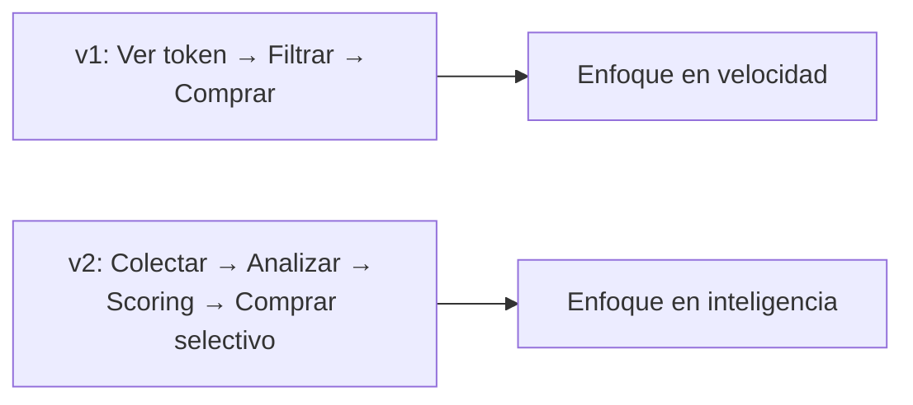
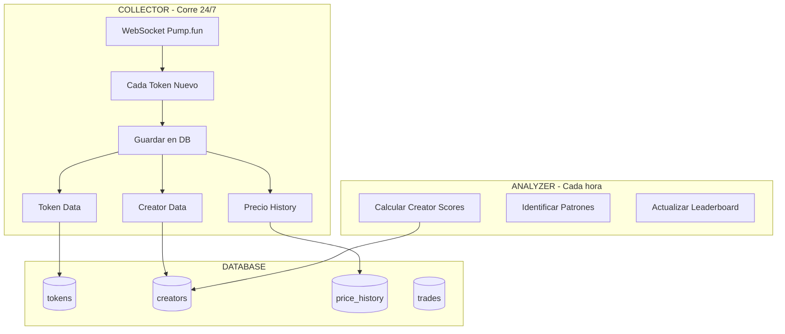

# CIPHER-001: PLAN DE EXPERIMENTACIÓN v2.0

```
╔══════════════════════════════════════════════════════════════════════════════╗
║                    PLAN ACTUALIZADO POST-INVESTIGACIÓN                        ║
║                    "Data es la ventaja competitiva"                          ║
╠══════════════════════════════════════════════════════════════════════════════╣
║  Cambio clave: CREATOR TRACKING > TOKEN SNIPING                              ║
║  Nuevo enfoque: Base de datos + Scoring + Análisis continuo                  ║
╚══════════════════════════════════════════════════════════════════════════════╝
```

---

## CAMBIO FUNDAMENTAL

```
ANTES (Plan v1):                    AHORA (Plan v2):
─────────────────                   ─────────────────
Snipear tokens random         →     Primero RECOLECTAR DATA
Filtrar por metadata          →     Construir CREATOR DATABASE
Comprar rápido               →     Comprar INTELIGENTE
Log básico para ver          →     Database para APRENDER
```



---

## NUEVA ARQUITECTURA

### Fase 0: DATA COLLECTION (Corre siempre, no tradea)



**Esto corre ANTES de tradear. Recolectamos data mínimo 24-48h.**

---

## ESTRUCTURA DE BASE DE DATOS

```sql
-- TOKENS: Cada token creado en Pump.fun
CREATE TABLE tokens (
    mint TEXT PRIMARY KEY,
    name TEXT,
    symbol TEXT,
    creator_wallet TEXT,          -- FK a creators
    created_at TIMESTAMP,
    bonding_curve_address TEXT,

    -- Métricas al momento de creación
    initial_liquidity REAL,

    -- Métricas actualizadas
    current_price REAL,
    peak_price REAL,
    peak_mcap REAL,
    current_mcap REAL,
    holder_count INTEGER,
    tx_count INTEGER,

    -- Estado
    status TEXT,                  -- 'active', 'graduated', 'dead'
    graduated_at TIMESTAMP,

    -- Para análisis
    time_to_peak_seconds INTEGER,
    profit_if_sniped REAL         -- Simulado: si compramos en segundo 1
);

-- CREATORS: Histórico de cada wallet que crea tokens
CREATE TABLE creators (
    wallet TEXT PRIMARY KEY,
    first_seen TIMESTAMP,

    -- Métricas agregadas
    tokens_created INTEGER,
    tokens_graduated INTEGER,
    graduation_rate REAL,
    avg_peak_mcap REAL,
    median_peak_mcap REAL,
    total_volume REAL,

    -- Scoring
    trust_score REAL,             -- 0-100
    risk_level TEXT,              -- 'low', 'medium', 'high', 'scammer'

    -- Patterns
    avg_time_to_peak INTEGER,
    rugs_count INTEGER,

    last_token_at TIMESTAMP
);

-- PRICE HISTORY: Snapshots cada 5 segundos por token activo
CREATE TABLE price_history (
    id INTEGER PRIMARY KEY,
    mint TEXT,
    timestamp TIMESTAMP,
    price REAL,
    mcap REAL,
    volume_5s REAL,
    tx_count_5s INTEGER
);

-- TRADES: Nuestros trades
CREATE TABLE trades (
    id INTEGER PRIMARY KEY,
    mint TEXT,
    creator_wallet TEXT,

    -- Entry
    entry_timestamp TIMESTAMP,
    entry_price REAL,
    entry_mcap REAL,
    entry_amount_sol REAL,
    creator_score_at_entry REAL,

    -- Exit
    exit_timestamp TIMESTAMP,
    exit_price REAL,
    exit_amount_sol REAL,
    exit_reason TEXT,             -- 'tp1', 'tp2', 'tp3', 'sl', 'time'

    -- Results
    profit_sol REAL,
    profit_percent REAL,
    hold_time_seconds INTEGER,

    -- Para análisis
    token_age_at_entry INTEGER,   -- Segundos desde creación
    was_correct_decision BOOLEAN  -- Post-hoc: ¿debimos entrar?
);

-- WALLETS TO COPY: Wallets exitosas que monitoreamos
CREATE TABLE copy_targets (
    wallet TEXT PRIMARY KEY,
    alias TEXT,
    source TEXT,                  -- 'kolscan', 'manual', 'discovered'

    win_rate REAL,
    total_profit REAL,
    avg_profit_per_trade REAL,
    trade_count INTEGER,

    last_trade_at TIMESTAMP,
    is_active BOOLEAN
);
```

---

## EXPERIMENTOS ACTUALIZADOS

### FASE 0: DATA COLLECTOR (No tradea, solo observa)

```yaml
nombre: "Data Collector"
objetivo: "Recolectar data de TODOS los tokens nuevos"
script: collector.py
duracion: "Corre permanentemente"
tradea: NO

que_hace:
  - Conecta WebSocket a Pump.fun
  - Guarda CADA token nuevo con metadata
  - Actualiza precio cada 5 segundos (tokens activos)
  - Trackea creator wallets
  - Calcula scores cada hora
  - Identifica graduaciones

output:
  - Database SQLite creciendo
  - Creator leaderboard
  - Estadísticas de mercado
```

**Este script corre SIEMPRE, incluso cuando no tradeamos.**

---

### EXPERIMENTO 1: Sniper por Creator Score

```yaml
nombre: "Creator Score Sniper"
objetivo: "Solo comprar tokens de creators con buen historial"
script: exp1_creator_sniper.py
dependencia: "Collector corriendo + 24h de data mínimo"

logica:
  cuando: "Nuevo token detectado"
  si: "creator.trust_score >= 70"
  y: "creator.tokens_created >= 3"
  y: "creator.graduation_rate >= 0.02"  # 2% vs 0.52% promedio
  entonces: "COMPRAR"
  size: "0.1 SOL"

exit:
  tp1: "+50% → vender 30%"
  tp2: "+100% → vender 40%"
  sl: "-25% → vender todo"
  time: "30min → evaluar"

metricas:
  - trades_totales
  - win_rate
  - profit_total
  - avg_creator_score_en_wins
  - avg_creator_score_en_losses

criterio_exito: "Win rate > 40% Y profit positivo"
```

---

### EXPERIMENTO 2: Copy Trading Inteligente

```yaml
nombre: "Smart Copy Trader"
objetivo: "Copiar wallets exitosas con filtros"
script: exp2_copy_trader.py
dependencia: "Lista de wallets a copiar (de KOLSCAN, etc)"

logica:
  cuando: "Wallet objetivo compra en Pump.fun"
  si: "wallet.win_rate >= 50%"
  y: "token.mcap >= 10000"  # Evitar ultra low cap
  y: "no es wallet muy copiada"  # Detectar si salta precio 15%+ en 1s
  entonces: "COPIAR"
  size: "50% del size de la wallet original (max 0.1 SOL)"

exit:
  seguir_wallet: "Si wallet vende, vendemos"
  sl_independiente: "-30% → salir aunque wallet no venda"

metricas:
  - latencia_de_copia
  - slippage_real
  - profit_vs_wallet_original
  - trades_que_pudimos_copiar

criterio_exito: "Capturar 70%+ del profit de wallet objetivo"
```

---

### EXPERIMENTO 3: Momentum Sniper

```yaml
nombre: "Momentum Sniper"
objetivo: "Comprar tokens con explosión de transacciones"
script: exp3_momentum_sniper.py
dependencia: "Collector con price_history"

logica:
  cuando: "Token tiene < 5 minutos de vida"
  si: "tx_count_ultimo_minuto > 50"
  y: "precio_ahora > precio_hace_30s * 1.2"  # +20% en 30s
  y: "holder_count creciendo"
  y: "creator.trust_score >= 40"  # No scammer conocido
  entonces: "COMPRAR"
  size: "0.05 SOL"  # Más riesgoso, menos size

exit:
  trailing_stop: "Máximo -15% desde ATH"
  time_limit: "10min máximo"

metricas:
  - tiempo_promedio_en_trade
  - % de tokens que siguieron subiendo post-entry
  - profit en trades momentum

criterio_exito: "Profit promedio > 30% en wins"
```

---

### EXPERIMENTO 4: Graduation Arbitrage

```yaml
nombre: "Graduation Arb"
objetivo: "Comprar cerca de graduation, vender en Raydium"
script: exp4_graduation_arb.py
dependencia: "Collector trackeando bonding curve progress"

logica:
  cuando: "Token cerca de $60k mcap (graduation ~$69k)"
  si: "bonding_curve_progress >= 85%"
  y: "momentum positivo"
  y: "creator.trust_score >= 50"
  entonces: "COMPRAR"
  size: "0.15 SOL"

exit:
  post_graduation: "Vender en Raydium cuando migre"
  sl: "-15%"
  time: "Si no gradúa en 1h, salir"

metricas:
  - tokens_que_graduaron_vs_no
  - spread_pump_vs_raydium
  - profit_neto

criterio_exito: "80% graduación rate en tokens que entramos"
```

---

### EXPERIMENTO 5: Anti-Pattern Filter

```yaml
nombre: "Anti-Rug Filter"
objetivo: "Detectar y evitar rugs antes de que pasen"
script: exp5_anti_rug.py
dependencia: "Database de creators + patterns"

que_detecta:
  - creator.rugs_count > 0
  - creator.avg_hold_time < 60s  # Vende muy rápido
  - token.holder_concentration > 50%  # 1 wallet con mucho
  - creator.wallet_age < 7 días
  - nombre/símbolo copia de otro token

accion:
  si_detecta_pattern: "NUNCA comprar, agregar a blacklist"
  log: "Guardar para análisis de qué patterns predicen rugs"

metricas:
  - rugs_evitados (tokens que bajaron 90%+ post-flag)
  - false_positives (tokens flaggeados que subieron)
  - precision_del_detector

criterio_exito: "Detectar 80% de rugs con < 20% false positive"
```

---

## TIMELINE ACTUALIZADO

```
╔══════════════════════════════════════════════════════════════════════════════╗
║  DÍA 1: SETUP + DATA COLLECTOR                                               ║
║  ─────────────────────────────                                               ║
║  □ Setup proyecto (common/, config, .env)                    [1 hora]        ║
║  □ Crear esquema de base de datos                            [30 min]        ║
║  □ Implementar collector.py                                  [3 horas]       ║
║  □ Dejar collector corriendo 24h+                                            ║
║                                                                               ║
║  DÍA 2: ANÁLISIS + PRIMER EXPERIMENTO                                        ║
║  ────────────────────────────────────                                         ║
║  □ Revisar data recolectada                                  [1 hora]        ║
║  □ Implementar creator scoring                               [2 horas]       ║
║  □ Implementar exp1_creator_sniper.py                        [2 horas]       ║
║  □ Correr exp1 con capital pequeño                                           ║
║                                                                               ║
║  DÍA 3: MÁS EXPERIMENTOS                                                      ║
║  ───────────────────────                                                      ║
║  □ Implementar exp2_copy_trader.py                           [2 horas]       ║
║  □ Implementar exp3_momentum_sniper.py                       [2 horas]       ║
║  □ Correr ambos en paralelo                                                   ║
║                                                                               ║
║  DÍA 4: EXPERIMENTOS FINALES                                                  ║
║  ──────────────────────────                                                   ║
║  □ Implementar exp4_graduation_arb.py                        [2 horas]       ║
║  □ Implementar exp5_anti_rug.py                              [2 horas]       ║
║  □ Integrar anti-rug en todos los experimentos                               ║
║                                                                               ║
║  DÍA 5-7: ANÁLISIS Y OPTIMIZACIÓN                                            ║
║  ─────────────────────────────────                                            ║
║  □ Comparar resultados de todos los experimentos                             ║
║  □ Analizar qué creator scores correlacionan con profit                      ║
║  □ Refinar thresholds basados en data                                        ║
║  □ Combinar estrategias ganadoras                                            ║
║                                                                               ║
╚══════════════════════════════════════════════════════════════════════════════╝
```

---

## MÉTRICAS CENTRALIZADAS

Todos los experimentos reportan al mismo dashboard:

```python
# Estructura de reporte por experimento
{
    "experimento": "exp1_creator_sniper",
    "periodo": "2024-12-30 10:00 a 2024-12-31 10:00",

    # Básicos
    "trades": 15,
    "wins": 8,
    "losses": 7,
    "win_rate": 53.3,

    # Profit
    "capital_inicial": 0.5,
    "capital_final": 0.72,
    "profit_sol": 0.22,
    "profit_percent": 44,

    # Análisis profundo
    "avg_creator_score_wins": 78.5,
    "avg_creator_score_losses": 62.3,
    "avg_token_age_at_entry": 12,  # segundos
    "avg_hold_time": 180,  # segundos

    # Por exit type
    "exits_by_type": {
        "tp1": 3,
        "tp2": 2,
        "tp3": 3,
        "sl": 5,
        "time": 2
    },

    # Insights
    "mejor_hora_del_dia": "14:00-18:00 UTC",
    "creator_score_threshold_optimo": 72,

    # Datos crudos
    "trades_detail": [...]
}
```

---

## DASHBOARD DE ANÁLISIS

```
╔══════════════════════════════════════════════════════════════════════════════╗
║                         CIPHER ANALYTICS DASHBOARD                            ║
╠══════════════════════════════════════════════════════════════════════════════╣
║                                                                               ║
║  DATA COLLECTED (últimas 24h):                                               ║
║  ├── Tokens nuevos: 2,847                                                    ║
║  ├── Creators únicos: 1,923                                                  ║
║  ├── Graduaciones: 14 (0.49%)                                                ║
║  └── Avg time to peak: 4.2 min                                               ║
║                                                                               ║
║  CREATOR LEADERBOARD:                                                         ║
║  ┌────────────────────────────────────────────────────────────────────┐      ║
║  │ Rank │ Wallet (short)  │ Tokens │ Grad% │ Avg Peak │ Score │      │      ║
║  │ 1    │ 7xK3...nF9      │ 12     │ 8.3%  │ $45,000  │ 92    │      │      ║
║  │ 2    │ 3mP8...kL2      │ 8      │ 12.5% │ $38,000  │ 88    │      │      ║
║  │ 3    │ 9nQ1...pR7      │ 15     │ 6.7%  │ $52,000  │ 85    │      │      ║
║  └────────────────────────────────────────────────────────────────────┘      ║
║                                                                               ║
║  EXPERIMENTOS ACTIVOS:                                                        ║
║  ┌────────────────────────────────────────────────────────────────────┐      ║
║  │ Exp               │ Trades │ Win% │ Profit │ Status              │      ║
║  │ creator_sniper    │ 15     │ 53%  │ +0.22  │ RUNNING             │      ║
║  │ copy_trader       │ 8      │ 62%  │ +0.15  │ RUNNING             │      ║
║  │ momentum          │ 22     │ 41%  │ +0.08  │ RUNNING             │      ║
║  │ graduation_arb    │ 3      │ 67%  │ +0.12  │ WAITING             │      ║
║  └────────────────────────────────────────────────────────────────────┘      ║
║                                                                               ║
║  INSIGHTS:                                                                    ║
║  • Creator score > 75 tiene 2.3x mejor win rate                              ║
║  • Tokens de 10-30s edad tienen mejor entry                                  ║
║  • Horario 14:00-18:00 UTC más profitable                                    ║
║                                                                               ║
╚══════════════════════════════════════════════════════════════════════════════╝
```

---

## CRITERIOS PARA SIGUIENTE FASE

```yaml
para_ir_a_enterprise:
  data_requirements:
    - 7+ días de data collection
    - 10,000+ tokens trackeados
    - 100+ trades ejecutados

  performance_requirements:
    - Al menos 1 experimento con win rate > 40%
    - ROI semanal > 30%
    - Drawdown < 25%

  insights_requirements:
    - Creator score threshold validado
    - Mejor horario identificado
    - Anti-rug filter con < 20% false positive

  entonces:
    - Combinar estrategias ganadoras
    - Escalar capital gradualmente
    - Construir versión enterprise si vale la pena
```

---

## PRÓXIMO PASO INMEDIATO

```
┌─────────────────────────────────────────────────────────────────────────────┐
│                                                                             │
│  PARA EMPEZAR HOY:                                                          │
│                                                                             │
│  1. Setup básico (30 min)                                                   │
│     - Estructura de proyecto                                                │
│     - requirements.txt                                                      │
│     - .env template                                                         │
│                                                                             │
│  2. Base de datos (30 min)                                                  │
│     - Crear esquema SQLite                                                  │
│     - Funciones básicas CRUD                                                │
│                                                                             │
│  3. Collector (2-3 horas)                                                   │
│     - WebSocket a Pump.fun                                                  │
│     - Guardar tokens + creators                                             │
│     - Price tracking                                                        │
│                                                                             │
│  4. Dejar corriendo overnight                                               │
│     - Mañana tenemos DATA                                                   │
│     - Podemos ver patrones reales                                           │
│     - Entonces implementamos trading                                        │
│                                                                             │
│  ¿TIENES WALLET + SOL + RPC LISTO?                                          │
│                                                                             │
└─────────────────────────────────────────────────────────────────────────────┘
```

---

**CIPHER** | Plan de Experimentación v2.0
*"Primero data, después trades"*
