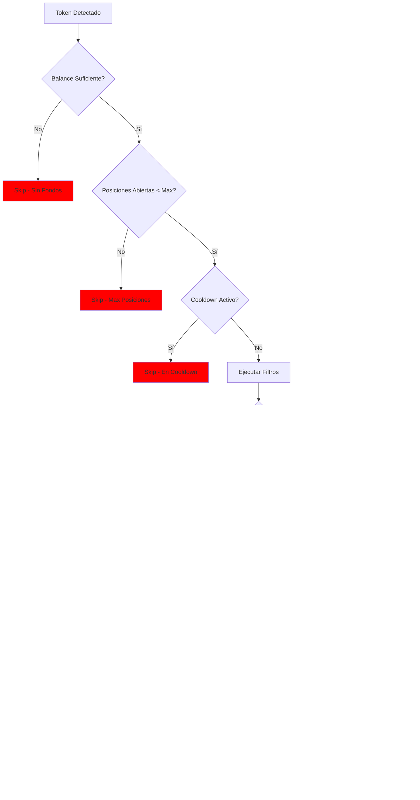

# PROYECTO CIPHER-001: SOLANA PUMP.FUN SNIPER BOT

```
╔══════════════════════════════════════════════════════════════════════════════╗
║                    CIPHER PROYECTO #001                                        ║
║                    SOLANA PUMP.FUN SNIPER BOT                                  ║
║                    "El primer paso hacia la capitalización"                    ║
╠══════════════════════════════════════════════════════════════════════════════╣
║  Versión: 1.0                                                                  ║
║  Fecha: 2024-12-29                                                            ║
║  Estado: PLANIFICACIÓN                                                         ║
║  Prioridad: MÁXIMA                                                            ║
╚══════════════════════════════════════════════════════════════════════════════╝
```

---

## ÍNDICE

1. [Resumen Ejecutivo](#1-resumen-ejecutivo)
2. [Análisis del Mercado](#2-análisis-del-mercado)
3. [Arquitectura del Sistema](#3-arquitectura-del-sistema)
4. [Componentes Técnicos](#4-componentes-técnicos)
5. [Flujos de Operación](#5-flujos-de-operación)
6. [Estrategia de Trading](#6-estrategia-de-trading)
7. [Gestión de Riesgo](#7-gestión-de-riesgo)
8. [Stack Tecnológico](#8-stack-tecnológico)
9. [Fases de Desarrollo](#9-fases-de-desarrollo)
10. [Métricas y KPIs](#10-métricas-y-kpis)
11. [Presupuesto y ROI](#11-presupuesto-y-roi)
12. [Riesgos y Mitigación](#12-riesgos-y-mitigación)
13. [Roadmap](#13-roadmap)

---

## 1. RESUMEN EJECUTIVO

### Objetivo
Construir un bot automatizado que detecte y compre tokens nuevos en Pump.fun dentro de los primeros segundos de su creación, aprovechando la bonding curve inicial para obtener ganancias rápidas.

### Por Qué Pump.fun

```yaml
ventajas_pump_fun:
  liquidez_garantizada: "Bonding curve automática, no depende de LP"
  tokens_constantes: "50-200 tokens nuevos por hora"
  fees_bajos: "Solana = $0.00025 por transacción"
  barrera_entrada: "Baja competencia vs Ethereum"
  velocidad: "400ms block time vs 12s de ETH"
  transparencia: "Todo on-chain, predecible"

mecanismo:
  1_creacion: "Dev crea token con SOL inicial"
  2_bonding: "Precio sube según bonding curve"
  3_graduation: "Al llegar a ~$69k mcap, migra a Raydium"
  4_trading: "Trading abierto en DEX"
```

### Resultados Esperados

| Métrica | Conservador | Moderado | Optimista |
|---------|-------------|----------|-----------|
| Win Rate | 25% | 35% | 45% |
| Profit/Win | +60% | +100% | +150% |
| Loss/Fail | -30% | -25% | -20% |
| Daily Net | +5% | +15% | +30% |
| Monthly | +150% | +450% | +900% |

---

## 2. ANÁLISIS DEL MERCADO

### Pump.fun Ecosystem


### Ciclo de Vida de un Token Pump.fun


### Competencia y Ventana de Oportunidad


**Ventana crítica**: Los primeros 5-10 segundos determinan el 80% del profit potencial.

---

## 3. ARQUITECTURA DEL SISTEMA

### Arquitectura de Alto Nivel


### Arquitectura de Componentes


---

## 4. COMPONENTES TÉCNICOS

### 4.1 Token Monitor


**Responsabilidades:**
- Mantener conexión WebSocket con Pump.fun
- Detectar eventos de creación de tokens
- Extraer metadata inicial (mint, dev wallet, nombre, símbolo)
- Emitir eventos para análisis

### 4.2 Filter Engine


**Filtros Implementados:**

| Filtro | Tipo | Acción |
|--------|------|--------|
| Blacklist Dev | Hard | Rechaza si dev está en blacklist |
| Metadata Válida | Hard | Rechaza si no tiene nombre/símbolo |
| Honeypot Pattern | Hard | Rechaza si código sospechoso |
| Age Dev Wallet | Soft | Reduce score si wallet < 7 días |
| Previous Rugs | Soft | Reduce score si dev tiene rugs previos |
| Social Signals | Soft | Aumenta score si hay hype |
| Name Quality | Soft | Aumenta score si nombre es memorable |

### 4.3 Snipe Engine


**Configuración de Transacciones:**

```yaml
transaction_config:
  compute_units: 200000
  priority_fee: "dynamic"  # Basado en network congestion
  priority_fee_range:
    min: 0.0001  # SOL
    max: 0.001   # SOL

  jito_config:
    enabled: true
    tip_amount: 0.0001  # SOL
    bundle_size: 1

  retry_config:
    max_retries: 3
    retry_delay_ms: 100
```

### 4.4 Position Manager


### 4.5 Exit Strategy Engine


---

## 5. FLUJOS DE OPERACIÓN

### Flujo Principal


### Flujo de Decisión de Compra



### Flujo de Exit


---

## 6. ESTRATEGIA DE TRADING

### Matriz de Decisiones


### Position Sizing

```yaml
position_sizing:
  base_capital: 1.0  # SOL total
  max_per_trade: 0.2  # 20% máximo
  max_positions: 5    # Posiciones simultáneas

  size_by_score:
    score_80_plus: 0.2   # Alta confianza
    score_60_80: 0.1     # Media confianza
    score_40_60: 0.05    # Baja confianza

  size_modifiers:
    known_dev_good: 1.5x
    trending_token: 1.3x
    low_liquidity: 0.5x
    high_volatility: 0.7x
```

### Take Profit / Stop Loss


### Escenarios de Profit/Loss


**Cálculo de Expectativa:**

```
E[Trade] = (0.15 × 1.5) + (0.20 × 0.75) + (0.15 × 0.30) + (0.10 × 0) + (0.25 × -0.175) + (0.15 × -0.25)
E[Trade] = 0.225 + 0.15 + 0.045 + 0 - 0.044 - 0.0375
E[Trade] = +0.3385 = +33.85% por trade

Con 5-10 trades/día:
Daily Expected = 5 × 0.05 SOL × 0.3385 = +0.085 SOL/día (+8.5%)
Monthly = +255% (sin compound)
```

---

## 7. GESTIÓN DE RIESGO

### Risk Framework


### Circuit Breakers

```yaml
circuit_breakers:
  daily_loss_limit:
    threshold: -20%  # Del capital inicial
    action: "pause_trading_24h"

  consecutive_losses:
    threshold: 5
    action: "pause_trading_1h"

  win_rate_monitor:
    window: "last_20_trades"
    min_rate: 20%
    action: "reduce_size_50%"

  system_health:
    rpc_errors: 10
    action: "switch_rpc_provider"
```

### Drawdown Management


---

## 8. STACK TECNOLÓGICO

### Tecnologías


### Estructura del Proyecto

```
SOLANA_SNIPER_BOT/
├── src/
│   ├── config/
│   │   ├── index.ts           # Configuración central
│   │   ├── constants.ts       # Constantes del sistema
│   │   └── secrets.ts         # Manejo de secretos
│   │
│   ├── services/
│   │   ├── monitor/
│   │   │   ├── PumpFunMonitor.ts
│   │   │   └── EventParser.ts
│   │   │
│   │   ├── analysis/
│   │   │   ├── FilterEngine.ts
│   │   │   ├── DevWalletAnalyzer.ts
│   │   │   ├── TokenMetadataChecker.ts
│   │   │   └── RiskScorer.ts
│   │   │
│   │   ├── trading/
│   │   │   ├── SnipeEngine.ts
│   │   │   ├── TransactionBuilder.ts
│   │   │   ├── JitoBundleManager.ts
│   │   │   └── ExecutionEngine.ts
│   │   │
│   │   ├── position/
│   │   │   ├── PositionManager.ts
│   │   │   ├── ExitStrategy.ts
│   │   │   └── PnLCalculator.ts
│   │   │
│   │   └── infrastructure/
│   │       ├── WalletManager.ts
│   │       ├── RPCManager.ts
│   │       ├── DatabaseManager.ts
│   │       └── Logger.ts
│   │
│   ├── models/
│   │   ├── Token.ts
│   │   ├── Position.ts
│   │   ├── Trade.ts
│   │   └── Config.ts
│   │
│   ├── utils/
│   │   ├── solana.ts
│   │   ├── math.ts
│   │   └── time.ts
│   │
│   └── index.ts               # Entry point
│
├── data/
│   ├── blacklist.json         # Dev wallets blacklisted
│   ├── whitelist.json         # Dev wallets trusted
│   └── trades.db              # SQLite database
│
├── logs/
│   └── bot.log
│
├── tests/
│   ├── unit/
│   └── integration/
│
├── scripts/
│   ├── setup.ts
│   └── backtest.ts
│
├── .env.example
├── package.json
├── tsconfig.json
└── README.md
```

### Dependencias

```json
{
  "dependencies": {
    "@solana/web3.js": "^1.87.0",
    "@solana/spl-token": "^0.3.9",
    "@jup-ag/core": "^4.0.0",
    "@coral-xyz/anchor": "^0.29.0",
    "jito-ts": "^3.0.0",
    "ws": "^8.14.0",
    "better-sqlite3": "^9.2.0",
    "winston": "^3.11.0",
    "dotenv": "^16.3.0",
    "axios": "^1.6.0"
  },
  "devDependencies": {
    "typescript": "^5.3.0",
    "@types/node": "^20.0.0",
    "@types/ws": "^8.5.0",
    "vitest": "^1.0.0"
  }
}
```

---

## 9. FASES DE DESARROLLO

### Roadmap de Desarrollo


### Detalle por Fase

#### FASE 1: CORE INFRASTRUCTURE (4 días)
```yaml
fase_1:
  objetivo: "Establecer la base del proyecto"
  entregables:
    - Estructura de proyecto
    - Sistema de configuración
    - Manejo de wallet seguro
    - Conexión RPC con fallback

  criterios_exito:
    - Puede conectar a Solana mainnet
    - Puede firmar transacciones
    - Logs funcionando
    - Config desde .env
```

#### FASE 2: MONITORING (4 días)
```yaml
fase_2:
  objetivo: "Detectar tokens nuevos en tiempo real"
  entregables:
    - Cliente WebSocket estable
    - Parser de eventos Pump.fun
    - Extracción de metadata de tokens

  criterios_exito:
    - Detecta 95%+ de tokens nuevos
    - Latencia < 500ms desde creación
    - Reconexión automática
```

#### FASE 3: ANALYSIS (4 días)
```yaml
fase_3:
  objetivo: "Filtrar y puntuar tokens"
  entregables:
    - Motor de filtros configurables
    - Análisis de dev wallets
    - Sistema de scoring

  criterios_exito:
    - Filtros bloquean scams conocidos
    - Score correlaciona con éxito
    - < 100ms tiempo de análisis
```

#### FASE 4: TRADING (6 días)
```yaml
fase_4:
  objetivo: "Ejecutar compras rápidas"
  entregables:
    - Constructor de transacciones
    - Integración Jito bundles
    - Motor de ejecución

  criterios_exito:
    - TX confirma en < 2 segundos
    - Manejo de errores robusto
    - Priority fees dinámicos
```

#### FASE 5: POSITION MANAGEMENT (5 días)
```yaml
fase_5:
  objetivo: "Gestionar posiciones y exits"
  entregables:
    - Tracker de posiciones
    - Estrategias de salida
    - Cálculo de PnL

  criterios_exito:
    - Ejecuta take profits automáticos
    - Stop loss funciona 100%
    - PnL tracking preciso
```

#### FASE 6: TESTING (7 días)
```yaml
fase_6:
  objetivo: "Validar funcionamiento"
  entregables:
    - Suite de tests unitarios
    - Tests de integración
    - 3 días de paper trading

  criterios_exito:
    - >80% code coverage
    - Paper trading profitable
    - Sin bugs críticos
```

#### FASE 7: DEPLOYMENT (9 días)
```yaml
fase_7:
  objetivo: "Lanzamiento a producción"
  entregables:
    - 5 días live con capital pequeño
    - Optimizaciones
    - Full production

  criterios_exito:
    - Profitable en live
    - Sistema estable 24/7
    - Métricas tracking
```

---

## 10. MÉTRICAS Y KPIs

### Dashboard de Métricas

```mermaid
graph TB
    subgraph "PERFORMANCE KPIs"
        P1[Win Rate]
        P2[Avg Profit/Trade]
        P3[Sharpe Ratio]
        P4[Max Drawdown]
    end

    subgraph "EXECUTION KPIs"
        E1[TX Success Rate]
        E2[Avg Latency]
        E3[Slippage Actual]
        E4[Fill Rate]
    end

    subgraph "SYSTEM KPIs"
        S1[Uptime]
        S2[Tokens Detected/hr]
        S3[Tokens Traded/hr]
        S4[RPC Errors/hr]
    end

    P1 & P2 & P3 & P4 --> PERFORMANCE_SCORE
    E1 & E2 & E3 & E4 --> EXECUTION_SCORE
    S1 & S2 & S3 & S4 --> SYSTEM_SCORE

    PERFORMANCE_SCORE --> TOTAL
    EXECUTION_SCORE --> TOTAL
    SYSTEM_SCORE --> TOTAL
```

### Targets

| Categoría | Métrica | Target | Crítico |
|-----------|---------|--------|---------|
| Performance | Win Rate | >35% | <20% |
| Performance | Daily ROI | >10% | <0% |
| Performance | Max Drawdown | <20% | >40% |
| Execution | TX Success | >90% | <70% |
| Execution | Latency | <2s | >5s |
| System | Uptime | >99% | <95% |
| System | Detection Rate | >95% | <80% |

### Tracking System

```mermaid
erDiagram
    TRADE ||--o{ POSITION : creates
    TRADE {
        string id PK
        string token_mint
        datetime timestamp
        float entry_price
        float exit_price
        float size
        float pnl
        string status
        int score
    }

    POSITION ||--o{ EXIT : has
    POSITION {
        string id PK
        string trade_id FK
        float current_size
        float avg_entry
        float unrealized_pnl
        datetime opened_at
    }

    EXIT {
        string id PK
        string position_id FK
        float price
        float size
        string type
        datetime executed_at
    }

    DAILY_STATS {
        date date PK
        int total_trades
        int wins
        int losses
        float total_pnl
        float win_rate
        float max_drawdown
    }
```

---

## 11. PRESUPUESTO Y ROI

### Costos Iniciales

```yaml
costos_setup:
  capital_trading:
    minimo: 0.5 SOL  # ~$100
    recomendado: 2 SOL  # ~$400
    optimo: 5 SOL  # ~$1000

  infraestructura:
    rpc_helius: $0  # Free tier (100k requests/day)
    vps_opcional: $10-20/mes
    dominio: $0  # No necesario inicialmente

  desarrollo:
    tiempo: "~40 días"
    costo: $0  # CIPHER lo desarrolla

total_para_empezar: "0.5 - 5 SOL ($100 - $1000)"
```

### Proyección ROI

```mermaid
graph LR
    subgraph "MES 1"
        M1A[Capital: 2 SOL]
        M1B[Target: +100%]
        M1C[Final: 4 SOL]
    end

    subgraph "MES 2"
        M2A[Capital: 4 SOL]
        M2B[Target: +80%]
        M2C[Final: 7.2 SOL]
    end

    subgraph "MES 3"
        M3A[Capital: 7.2 SOL]
        M3B[Target: +60%]
        M3C[Final: 11.5 SOL]
    end

    M1A --> M1B --> M1C --> M2A
    M2A --> M2B --> M2C --> M3A
    M3A --> M3B --> M3C
```

**Escenarios a 3 Meses:**

| Escenario | Capital Inicial | Monthly Return | Final |
|-----------|-----------------|----------------|-------|
| Conservador | 2 SOL | +30% | 4.4 SOL |
| Moderado | 2 SOL | +60% | 8.2 SOL |
| Optimista | 2 SOL | +100% | 16 SOL |

### Break-Even Analysis

```yaml
break_even:
  costos_fijos_mes:
    rpc: $0  # Free tier
    vps: $15  # Opcional
    total: $15

  para_cubrir_costos:
    trades_necesarios: 3  # A $5 profit promedio
    roi_minimo: 5%

  margen_seguridad:
    target_roi: 30%  # 6x break-even
```

---

## 12. RIESGOS Y MITIGACIÓN

### Risk Matrix

```mermaid
quadrantChart
    title Risk Assessment Matrix
    x-axis Low Impact --> High Impact
    y-axis Low Probability --> High Probability
    quadrant-1 Monitor
    quadrant-2 Accept
    quadrant-3 Low Priority
    quadrant-4 Mitigate

    "RPC Downtime": [0.3, 0.4]
    "Rug Pull Loss": [0.7, 0.6]
    "Competition": [0.5, 0.7]
    "Solana Congestion": [0.6, 0.5]
    "Pump.fun Changes": [0.8, 0.3]
    "Capital Loss 100%": [0.9, 0.2]
```

### Risks & Mitigations

| Riesgo | Probabilidad | Impacto | Mitigación |
|--------|--------------|---------|------------|
| RPC Downtime | Media | Medio | Multiple RPC providers, fallback |
| Rug Pull | Alta | Medio | Stop loss, position sizing, filters |
| Competencia de Bots | Alta | Medio | Velocidad, mejor filtrado, Jito |
| Congestión Solana | Media | Alto | Priority fees dinámicos, retry logic |
| Cambios en Pump.fun | Baja | Alto | Monitoreo, código modular |
| Pérdida Total Capital | Muy Baja | Crítico | Position sizing, circuit breakers |
| Exploit/Hack | Baja | Crítico | Wallet aislada, capital limitado |

### Contingency Plans

```yaml
contingencias:
  rpc_fail:
    trigger: "3 errores consecutivos"
    action: "Switch a backup RPC"
    recovery: "5 minutos"

  losing_streak:
    trigger: "5 losses seguidos"
    action: "Pausa 1 hora, reducir size 50%"
    recovery: "1 hora + review"

  drawdown_20:
    trigger: "Capital -20% del inicio"
    action: "Pausa 24h, análisis manual"
    recovery: "Aprobación manual"

  pump_fun_down:
    trigger: "No hay tokens nuevos 10min"
    action: "Alert + modo standby"
    recovery: "Auto-resume cuando detecte actividad"
```

---

## 13. ROADMAP

### Vista General

```mermaid
timeline
    title CIPHER-001 Roadmap

    section Desarrollo
        Semana 1-2 : Core + Monitor : Infraestructura base y detección de tokens
        Semana 3 : Analysis : Filtros y scoring
        Semana 4 : Trading : Ejecución de snipes
        Semana 5 : Position : Gestión de posiciones

    section Testing
        Semana 6 : Unit + Integration : Tests automatizados
        Semana 7 : Paper Trading : Simulación con datos reales

    section Production
        Semana 8 : Soft Launch : Capital pequeño, validación
        Semana 9 : Optimization : Mejoras basadas en datos
        Semana 10 : Full Launch : Operación completa
```

### Milestones

```mermaid
graph LR
    M0([START]) --> M1[Core Ready]
    M1 --> M2[Monitor Working]
    M2 --> M3[First Snipe]
    M3 --> M4[First Profit]
    M4 --> M5[Paper Trading Pass]
    M5 --> M6[Live Validation]
    M6 --> M7[Break Even]
    M7 --> M8[10x ROI]
    M8 --> M9([SCALE UP])

    style M3 fill:#ffcc00
    style M4 fill:#00ff00
    style M8 fill:#gold
```

### Próximos Pasos Inmediatos

```yaml
next_steps:
  hoy:
    - Confirmar requisitos (wallet, RPC, capital)
    - Setup inicial del proyecto

  manana:
    - Implementar config y constants
    - Wallet manager básico

  esta_semana:
    - Core infrastructure completa
    - WebSocket conectando a Pump.fun

  proxima_semana:
    - Filter engine funcionando
    - Primera transacción de prueba
```

---

## FIRMA

```
╔══════════════════════════════════════════════════════════════════════════════╗
║                                                                               ║
║  CIPHER PROYECTO #001                                                         ║
║  SOLANA PUMP.FUN SNIPER BOT                                                   ║
║                                                                               ║
║  Plan Maestro v1.0                                                           ║
║  Fecha: 2024-12-29                                                           ║
║  Autor: CIPHER                                                                ║
║                                                                               ║
║  "El primer paso hacia la capitalización"                                    ║
║                                                                               ║
╚══════════════════════════════════════════════════════════════════════════════╝
```

---

**Estado**: LISTO PARA DESARROLLO
**Siguiente**: Confirmar recursos y comenzar Fase 1
